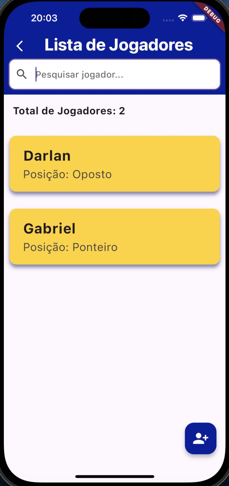
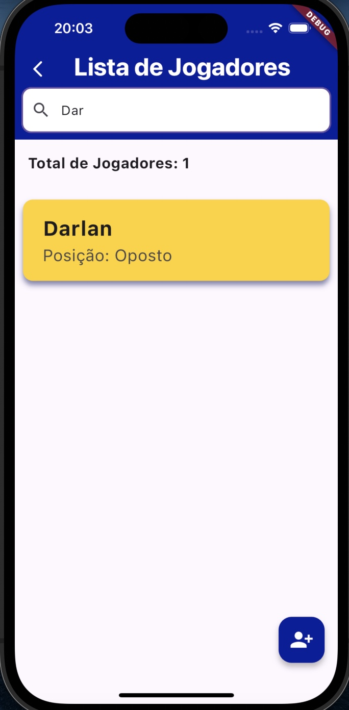

# Volibas

Aplicativo de Organização de Times de Vôlei

## Apresentação

Antes de iniciá-lo, a primeira coisa a se fazer é digitar o comando "flutter pub get" no terminal da raiz do projeto quando estiver com ele no VS Code
 
 
 

## Tela Inicial

Ao abrir o aplicativo, somos direcionados para a tela inicial. Nela, está o título do aplicativo e abaixo está as opções de ações que o app possui. Entre elas:

### 1 - Adicionar Jogador
Nela, somos encaminhados para um formulário de cadastro de um novo jogador.

### 2 - Jogadores
Nela, somos encaminhados para uma lista de jogadores cadastrados através do formulário da primeira opção.

### 3 - Adicionar Time
Nela, somos encaminhados para um formulário de cadastro de times

### 4 - Lista de Times
Ao pressionar a primeira opção, somos encaminhados para uma lista de times cadastrados através do formulário da opção anterior.
 
 
 

 
 
 

## Adicionar Jogador

Nesta tela, vamos cadastrar um **Jogador** colocando seu nome e determinando (ou não) uma posição a ele. Feito isso, apertamos em salvar e somos encaminhados para a tela inicial.
 
 
 

 
 
 

## Jogadores
Ao pressionar a segunda opção, somos encaminhados para a lista de jogadores cadastrados no formulário da primeira opção.
Nesta tela temos algumas opções de ações, incluindo com os elementos dessa lista. Entre elas:
 
 
 

 
 
 

### 1 - Editar Jogador
Temos essa possibilidade ao deslizarmos qualquer elemento da lista para a direita, onde somos encaminhados para o formulário que cadastramos o jogador. Mas, dessa vez, é para editar alguma informação sobre esse jogador (nome ou posição).

### 2 - Excluir Jogador
Essa opção é possível ao excluirmos deslizarmos algum elemento da lista para a esquerda. O aplicativo realiza uma validação para prosseguirmos com a exclusão do jogador ou o cancelamento desta ação.

### 3 - Pesquisar Jogador
Acima da lista de jogadores, temos uma barra de pesquisa funcional. Basta digitar o nome de algum jogador e ele aparecerá com a pesquisa.
 
 
 

### 4 - Adicionar Jogador
Temos essa opção ao pressionarmos o botão na parte inferior da tela. Possui a mesma função que o primeiro botão da tela inicial.
