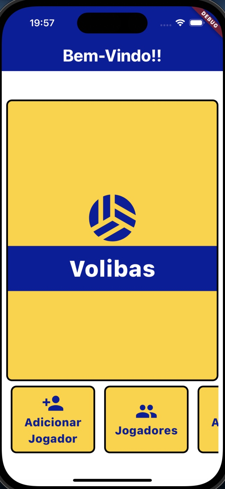
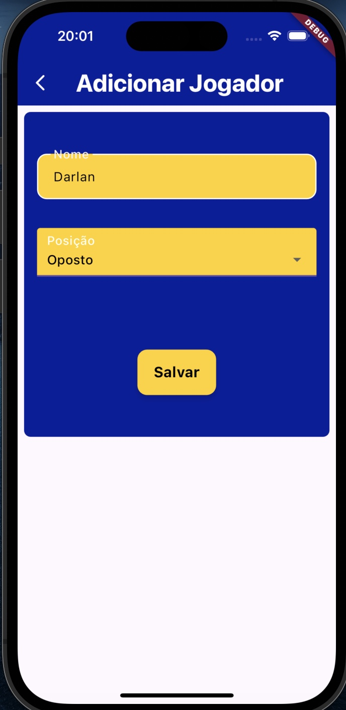

# Volibas

Aplicativo de Organização de Times de Vôlei

## Apresentação

Antes de iniciá-lo, a primeira coisa a se fazer é digitar o comando "flutter pub get" no terminal da raiz do projeto quando estiver com ele no VS Code

## Tela Inicial

Ao abrir o aplicativo, somos direcionados para a tela inicial. Nela, está o título do aplicativo e abaixo está as opções de ações que o app possui. Entre elas:

### 1 - Adicionar Jogador
Nela, somos encaminhados para um formulário de cadastro de um novo jogador.

### 2 - Jogadores
Nela, somos encaminhados para uma lista de jogadores cadastrados através do formulário da primeira opção.

### 3 - Adicionar Time
Nela, somos encaminhados para um formulário de cadastro de times

### 4 - Lista de Times
Nela, somos encaminhados para uma lista de times cadastrados através do formulário da opção anterior.

## Adicionar Jogador

Nesta tela, vamos cadastrar um *Jogador* colocando seu nome e determinando (ou não) uma posição a ele. Feito isso, apertamos em salvar e somos encaminhados para a tela inicial.

